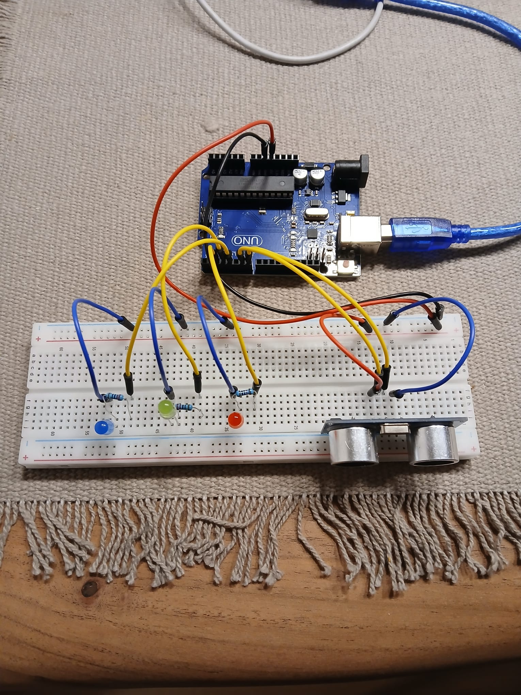
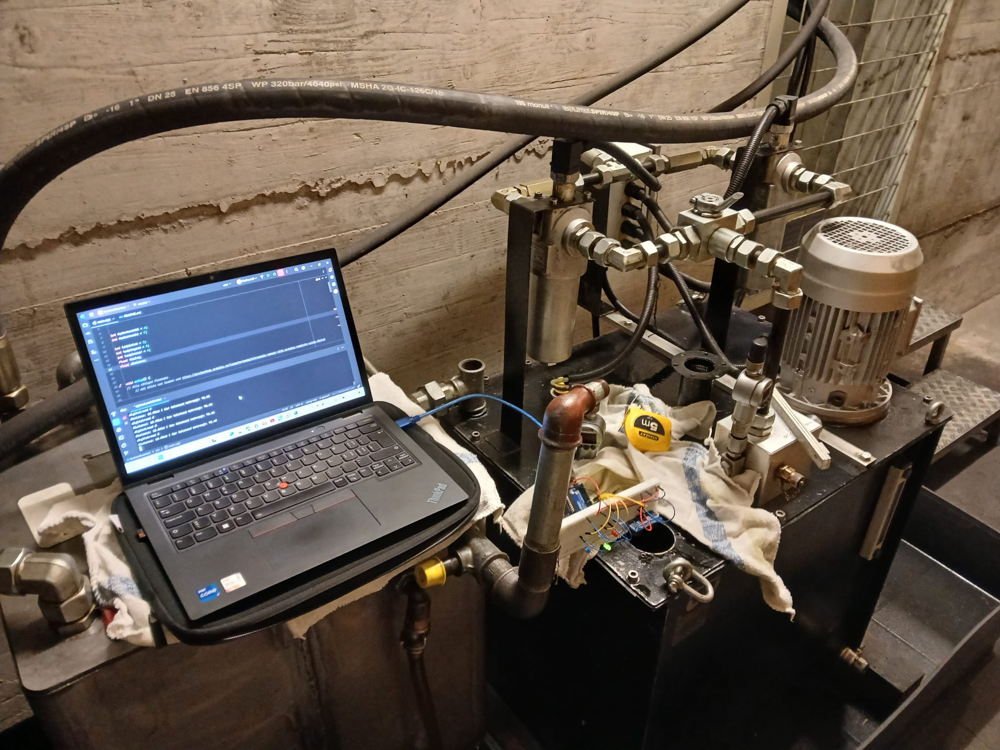

# Arduino Hydrauliktankmessung

## Anforderungen
| Anforderung                                                           | Muss | Wunsch | Verantwortung |
|-----------------------------------------------------------------------| ---- | ------ |---------------|
| Die Sensoren messen den Füllstand des Hydrauliköltanks                | X    |        | HippoPaddy    |
| Sobald der Füllstand gemessen worden ist, wird er in % umgerechnet    | X    |        | HippoPaddy    |
| Wenn der Füllstand unter 20% fällt, leuchtet die rote Lampe           | X    |        | HippoPaddy    |
| Wenn der Füllstand über 100% steigt, leuchtet die blaue Lampe         | X    |        | HippoPaddy    |
| Wenn der Füllstand zwischen 20 und 100% ist, leuchtet die grüne Lampe | X    |        | HippoPaddy    |
| Der umgerechnete Füllstand wird digital als ganze Zahl angezeigt      |      | X      | HippoPaddy    |
| Zusätzlich wird berechnet, ob wieder gleichviel zurückgeflossen ist   |      | X      | HippoPaddy    |

## Projektplan
- 30.01.2024 - Projektplan
- 30.01.2024 - Kompatibilität von Hardware überprüft
- 07.12.2024 - Flussdiagramm erstellt
- 14.12.2024 - Softwarecode geschrieben (nicht eingehalten; wird auf 21.12 verschoben)
- 21.12.2024 - Tests abgeschlossen (Letzte Tests wurden auf nach der Vollendung des Programmes getestet)
- 21.12.2024 - Komponenten getestet
- 04.01.2025 - Projektabschluss (Video, Dokumentation, Präsentation)

## Flussdiagramm

In diesem Flussdiagram wir mit dem Arduino Ultrasonic Sensor die Distanz zwischen des Sensors und der Flüssigkeit gemessen und umgerechnet.
Hauptsächlich besteht das Programm aber aus der Verzweigung welche Lampe bei welchem Füllstand leuchten soll.

## Projektbeschreibung
Kurze Beschreibung der Vorgehensweise

- Welche Teilfunktionen habt ihr einzeln getestet?
- Die einzelnen Funktionen, die getestet wurden, waren: das Programm, die Arduino Komponenten und ob der Sensor die Oberfläche des Öls erfassen kann

- Gab es dabei Probleme, wenn ja welche?
- Beim Schreiben des Programms kamen einige Fehlermeldungen, die ich mithilfe von Isabel und dem Internet behoben habe.
- Einzelne Arduino Komponenten, die nicht funktioniert haben. Diese habe ich ersetzen müssen.

- Konnten alle Muss-Anforderungen umgesetzt werden?
- Ja, alle

- War etwas unerwartet beim Schreiben des Programcodes?
- Ja. Ich wusste nicht, dass ich einen Pin für jeweils das Senden und Erfassen der Ultraschallwellen einfügen musste

## Tests
Kurze Beschreibung der Vorgehensweise

- Was sind die Testscenarios?
- Programmtest: Funktioniert das Programm wie es soll?
- Komponenten und Verkabelungstests: Ist alles richtig verkabelt und gibt das Programm anhand der erfassten Daten die Richtige Distanz an?
- Aufnametest: Erkennt der Sensor die Oberfläche des Hydrauliköls?

- Beschreibung oder Bild das Testziel aufzeigt
- Das Programm läuft wie es soll / gewollt ist.
- Die Komponenten funktionierten nicht und haben Anfangs immer den Füllstand von 113.208% angezeigt (Distanz = 0cm)
- Die Komponenten mussten zwar ersetzt werden, aber messen die Distanz und das Programm rechnet dies dann in die Distanz um.
- 
- Gibt es spezielle Gründe warum diese Tests gewählt wurden?
- Ich habe schlechte Erfahrungen gemacht mit Arduino Komponenten, deswegen musste ich sie ersetzen und testen.
- Ich war mir nicht sicher, ob der Sensor die Oberfläche des Öls erfasen kann.

## Bilder und Videos von Tests

### Programmtest Video:

Video:

### Funktionalitätstests: 

Videos:

