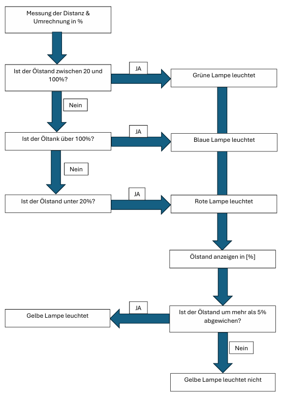

# Arduino Hydrauliktankmessung

## Anforderungen
| Anforderung                                                           | Muss | Wunsch | Verantwortung |
|-----------------------------------------------------------------------| ---- | ------ |---------------|
| Die Sensoren messen den Füllstand des Hydrauliköltanks                | X    |        | HippoPaddy    |
| Sobald der Füllstand gemessen worden ist, wird er in % umgerechnet    | X    |        | HippoPaddy    |
| Wenn der Füllstand unter 20% fällt, leuchtet die blaue Lampe          | X    |        | HippoPaddy    |
| Wenn der Füllstand über 100% steigt, leuchtet die Rote Lampe          | X    |        | HippoPaddy    |
| Wenn der Füllstand zwischen 20 und 100% ist, leuchtet die grüne Lampe | X    |        | HippoPaddy    |
| Der umgerechnete Füllstand wird digital als ganze Zahl angezeigt      |      | X      | HippoPaddy    |
| //                                                                    |      | X      | HippoPaddy    |

## Projektplan
- 30.01.2024 - Projektplan
- 30.01.2024 - Kompatibilität von Hardware überprüft
- 07.12.2024 - Komponenten getestet
- 07.12.2024 - Flussdiagramm erstellt
- 14.12.2024 - Softwarecode geschrieben
- 21.12.2024 - Tests abgeschlossen
- 04.01.2025 - Projektabschluss (Video, Dokumentation, Präsentation)

## Flussdiagramm
Hier können die wichtigsten Punkte des Flussdiagramms kurz beschrieben werden.

Zum Beispiel so:
In diesem Flussdiagramm wird der Ablauf von einem Prüfungsauswerter aufgezeigt. Der wichtigste Teil des Programmes ist die Verzweigung, hier wird entschieden ob die Prüfung bestanden wurde oder nicht. Dafür wird überprüft, ob 60 Punkte erreicht wurden oder nicht.

## Projektbeschreibung
Kurze Beschreibung der Vorgehensweise

- Welche Teilfunktionen habt ihr einzeln getestet?
- Gab es dabei Probleme, wenn ja welche?
- Konnten alle Muss-Anforderungen umgesetzt werden?
- Nein, warum konnten nicht alle umgesetzt werden?
- War etwas unerwartet beim Schreiben des Programcodes?

## Tests
Kurze Beschreibung der Vorgehensweise

- Was sind die Testscenarios?
- Beschreibung oder Bild das Testziel aufzeigt
- Gibt es spezielle Gründe warum diese Tests gewählt wurden?